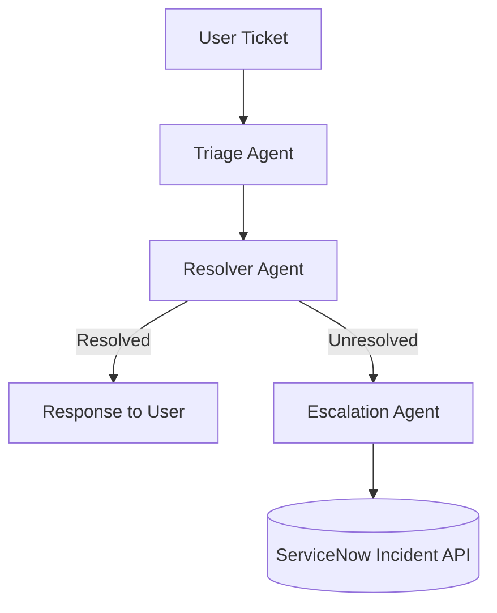

# MAF_AgenticAI - Service Desk Support (Python)

Python-based Agentic AI demo for Service Desk Support with a multi-agent design, Azure AI Foundry-ready configuration, ServiceNow integration, and PowerShell-backed tools.

## Architecture



### Agents
- **Triage Agent**: classifies ticket type/category/priority/sentiment.
- **Resolver Agent**: searches local KB and executes PowerShell tools for common remediations.
- **Escalation Agent**: creates and checks ServiceNow incidents when unresolved.

## Setup

```bash
python -m venv .venv
source .venv/bin/activate  # Windows: .venv\\Scripts\\activate
pip install -r requirements.txt
```

Copy `.env.example` to `.env` and populate values.

## Required environment variables

- `AZURE_AI_FOUNDRY_PROJECT_ENDPOINT`
- `AZURE_AI_FOUNDRY_MODEL_DEPLOYMENT`
- `AZURE_AI_FOUNDRY_API_VERSION`
- `SERVICENOW_INSTANCE_URL`
- `SERVICENOW_USERNAME`
- `SERVICENOW_PASSWORD`
- `SERVICENOW_TIMEOUT_SECONDS` (optional)
- `SERVICENOW_MAX_RETRIES` (optional)

> Credentials are read from environment variables only. Do not commit real values.

## Run sample conversation

```bash
python main.py
```

## Run tests

```bash
python -m pytest -q
```

## PowerShell tool notes

Scripts are located in `scripts/powershell/` and executed via `pwsh`.
If `pwsh` is not installed, tool execution is safely skipped so CI can still run tests.
To extend for real admin actions, add parameterized scripts and preserve least-privilege execution controls.
